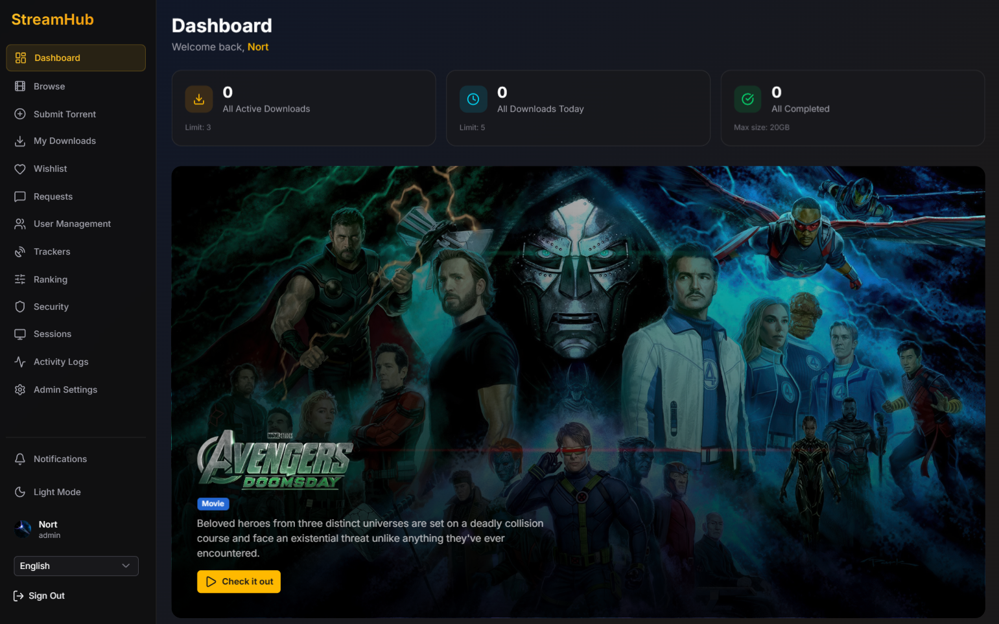

<p align="center">
  
</p>

<p align="center">
  
  
  
  
  
  
  
  
  
</p>

<p align="center">
  Self-hosted streaming hub for managing torrent downloads. Browse movies and TV shows from TMDB, find torrents via Prowlarr, and download with one click.
</p>

## Get started

Paste this into your terminal and follow the guided setup:

**Linux / macOS**

```bash
curl -fsSL https://raw.githubusercontent.com/Nort1346/StreamHub/main/setup.sh | bash
```

**Windows (PowerShell)**

```powershell
irm https://raw.githubusercontent.com/Nort1346/StreamHub/main/setup.ps1 | iex
```

The script checks Docker, pulls the full stack, generates secrets, and walks you through each API key. Prefer manual setup? See [Quick Start](#quick-start) below.

## Features

| | |
|---|---|
| **Browse & Search** | TMDB carousels, spotlights, full-text search with genre filters |
| **Torrent Ranking** | Configurable 240-point scoring engine - resolution, language, seeders, source |
| **Private Trackers** | Cookie and login-based auth with auto-retry on session expiry |
| **User Management** | Per-user limits, session control, brute force protection, auto-expiration, password generation |
| **Jellyfin Sync** | Library detection, user CRUD sync, avatar upload, Live TV config |
| **Notifications** | SSE real-time, Discord webhooks, browser push (VAPID) |
| **Admin Panel** | Live logs, system status, disk monitoring, ranking config |
| **PWA** | Installable app with offline support and push notifications |

## Preview

<p align="center">
  
</p>

## Quick Start

### Option 1: Auto-Setup (Recommended)

Run the one-line command from [Get started](#get-started), then the guided script walks you through 12 steps:
1. Check prerequisites (Docker, Docker Compose)
2. Create `.env` from `.env.example`
3. Generate secrets (session password, tracker encryption key)
4. Download the appropriate `docker-compose` file (`docker-compose.sqlite.yml` or `docker-compose.postgres.yml`)
5. Start infrastructure services (Redis, qBittorrent, Prowlarr, FlareSolverr, Jellyfin, Dozzle)
6. Get your **Jellyfin API key** (guided instructions)
7. Configure **qBittorrent WebUI + API key** (shows temp password, step-by-step)
8. Get your **Prowlarr API key** (guided instructions)
9. Get your **TMDB API key** (guided instructions)
10. Set **Discord webhook** (optional)
11. Pull StreamHub Docker image
12. Start StreamHub with health check

After setup, open **http://localhost:5757** and login with `admin / admin`. Create users in Admin > Users.

### Option 2: Manual Setup

#### Prerequisites

- Node.js 22+
- pnpm 11+
- qBittorrent with WebUI API key enabled

```bash
git clone https://github.com/Nort1346/StreamHub.git
cd StreamHub
pnpm install
cp .env.example .env    # then edit with your settings
pnpm dev                # opens at http://localhost:5757
```

Default admin: `admin` / `admin` - login and create users in Admin > Users.

## Docker

```bash
cp .env.example .env        # configure first
# Choose one:
docker compose -f docker-compose.sqlite.yml up -d --build     # SQLite (default)
# docker compose -f docker-compose.postgres.yml up -d --build # PostgreSQL
docker compose -f docker-compose.sqlite.yml logs -f            # view logs
```

| Service | Port | Purpose |
|---------|------|---------|
| `streamhub` | 5757 | Application |
| `qbittorrent` | 8080 | Torrent client |
| `prowlarr` | 9900 | Indexer manager |
| `jellyfin` | 8096 | Media server |
| `redis` | 6379 | Caching (optional) |
| `dozzle` | 8082 | Live log viewer |

## Tech Stack

| Layer | Technology |
|-------|-----------|
| Framework | Nuxt 4 + Nuxt UI 4 + Tailwind CSS v4 |
| Database | Drizzle ORM - SQLite (default) or PostgreSQL |
| Auth | nuxt-auth-utils (cookie sessions, bcrypt) |
| Integrations | TMDB, Prowlarr, qBittorrent, Jellyfin, Discord |
| Notifications | SSE + Web Push (VAPID) + Discord webhooks |
| PWA | @vite-pwa/nuxt (auto-update, Workbox) |

## Documentation

Full documentation lives in [`docs/`](./docs/):

- **[Getting Started](./docs/getting-started.md)** - Prerequisites, installation, first run
- **[Configuration](./docs/configuration.md)** - All environment variables and settings
- **[Architecture](./docs/architecture.md)** - Project structure, tech stack, composables
- **[Database](./docs/database.md)** - Schema (13 tables), migrations, SQLite vs PostgreSQL
- **[Deployment](./docs/deployment.md)** - Docker setup, production tips
- **[Features](./docs/features/)** - 13 feature guides (browse, torrents, users, Jellyfin, etc.)
- **[API Reference](./docs/api/)** - Complete endpoint documentation

## Why StreamHub

Unlike request-only tools (Overseerr, Seerr) that stop at "request and forget", StreamHub owns the full loop:

- **One-click download** - picks the best torrent via a 240-point ranking engine and sends it straight to qBittorrent.
- **Private tracker support** - cookie/login auth with auto-retry on session expiry, not just public indexers.
- **Built-in user system** - per-user limits, session control, brute-force protection, and auto-expiration. No external auth provider required.
- **Jellyfin-native** - library detection, user sync, and avatar management out of the box.
- **Real-time everything** - SSE live logs, browser push (VAPID), and Discord notifications.
- **Self-hosted first** - Docker Compose stack, SQLite by default (PostgreSQL optional), no cloud dependency.

## StreamHub vs Seerr

[Seerr](https://github.com/seerr-team/seerr) (formerly Overseerr / Jellyseerr) is a request management layer that sits on top of the *arr stack (Radarr, Sonarr, Prowlarr) and Jellyfin/Emby/Plex. Users request media, and *arr apps fetch it automatically. StreamHub replaces Radarr, Sonarr, and the request layer with a single app that gives you direct control over torrent selection.

The key difference is *who controls the download*:

| | StreamHub | [Seerr](https://github.com/seerr-team/seerr) |
|---|---|---|
| **Primary flow** | Browse TMDB → rank torrents → send to qBittorrent | Request → *arr (Radarr/Sonarr) fetches |
| **Torrent control** | Direct qBittorrent, one-click, manual pick | Delegated to *arr, no manual torrent pick |
| **Torrent ranking** | Built-in 240-point scoring engine | None (left to *arr) |
| **Private trackers** | Cookie/login auth with auto-retry | Via *arr indexers only |
| **User management** | Built-in: per-user limits, brute-force, sessions, expiry | Media-server OAuth only |
| **Real-time logs** | SSE live logs in admin panel | - |
| **Notifications** | SSE + Discord + browser push (VAPID) | Discord / Slack / Telegram webhooks |
| **PWA** | Installable, offline, push notifications | Mobile-responsive UI |
| **Media servers** | Jellyfin (Emby planned) | Jellyfin, Emby, Plex |
| **Auto-setup** | One-command `setup.sh` / `setup.ps1` (Docker + guided keys) | Manual compose / docs only |
| **Translations** | EN, PL, DE, FR, ES (community) | Crowdsourced via Weblate |
| **Best for** | Owning the full download loop + custom user tiers | *arr users wanting request management on top |

StreamHub gives your users the ability to browse and download content themselves -- no admin intervention needed. Each user gets their own limits, session control, and a torrent ranking engine that picks the best source automatically.

## Roadmap

- [ ] Emby support (additional media server)
- [ ] Prowlarr indexer management (add/configure indexers from StreamHub admin)
- [ ] Home Assistant integration (webhook, sensors, automations)

Got an idea? [Open a feature request](.github/ISSUE_TEMPLATE/feature_request.yml).

## Contributing

Contributions are welcome! See [CONTRIBUTING.md](.github/CONTRIBUTING.md) for setup, testing, and PR guidelines.

## License

[AGPL-3.0](LICENSE) - Copyright (C) 2026 Nort
